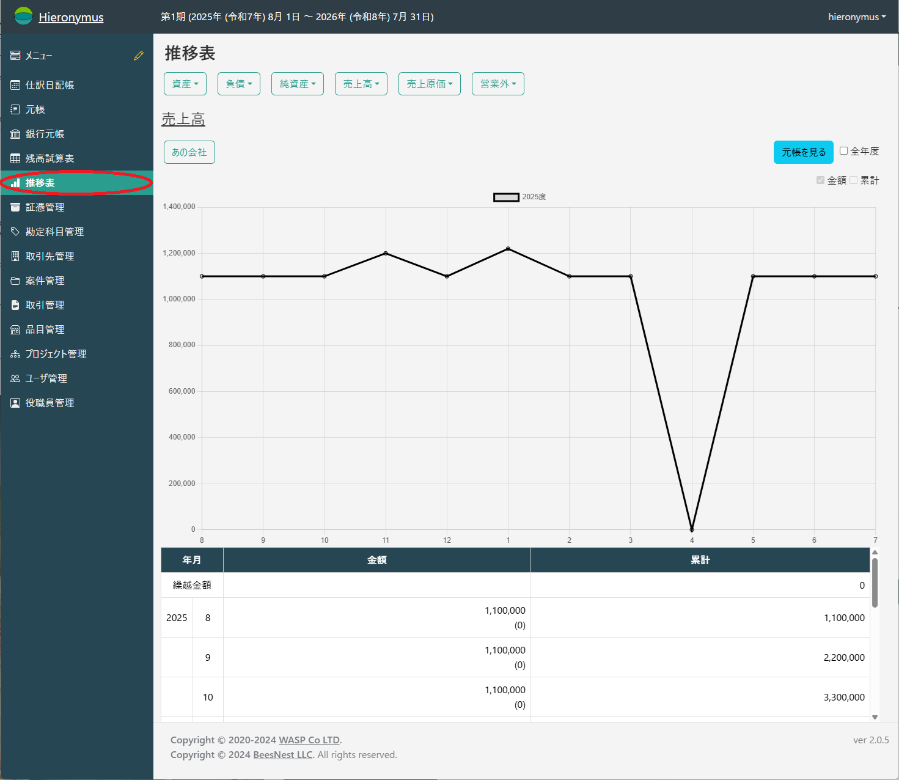
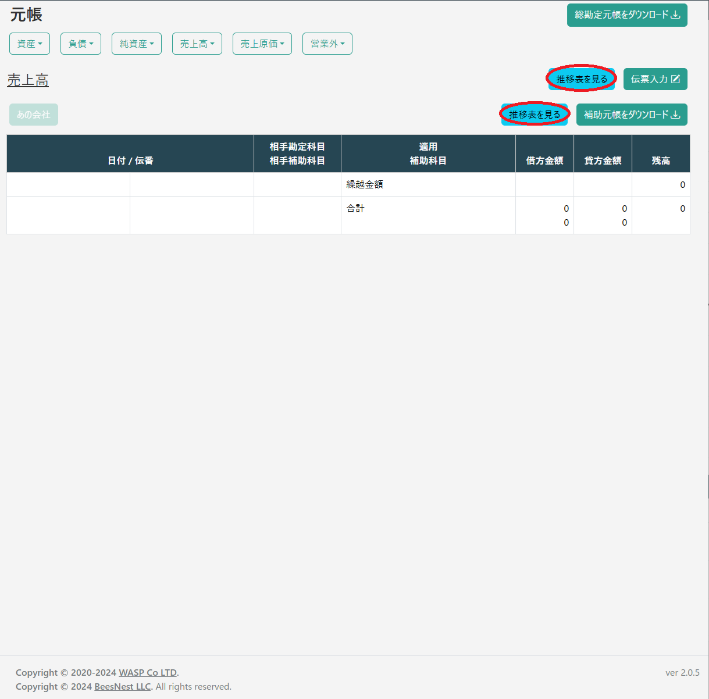
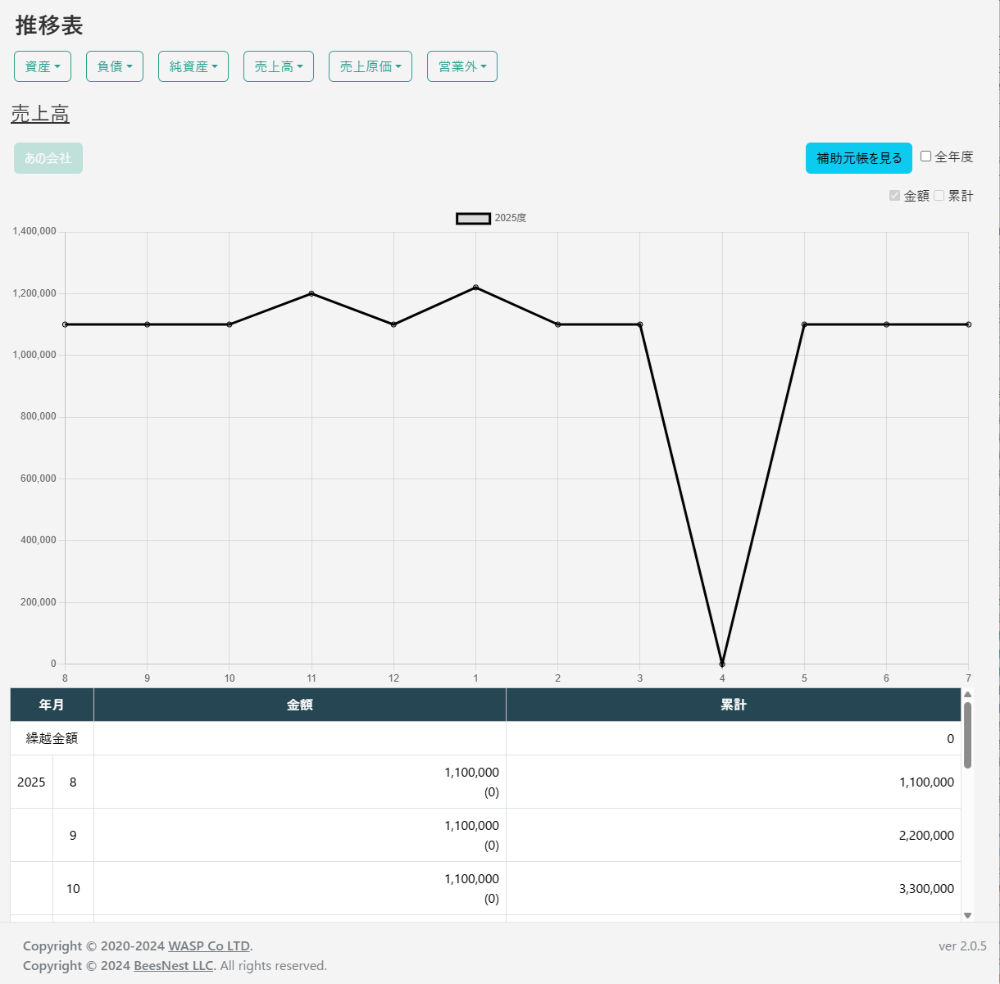
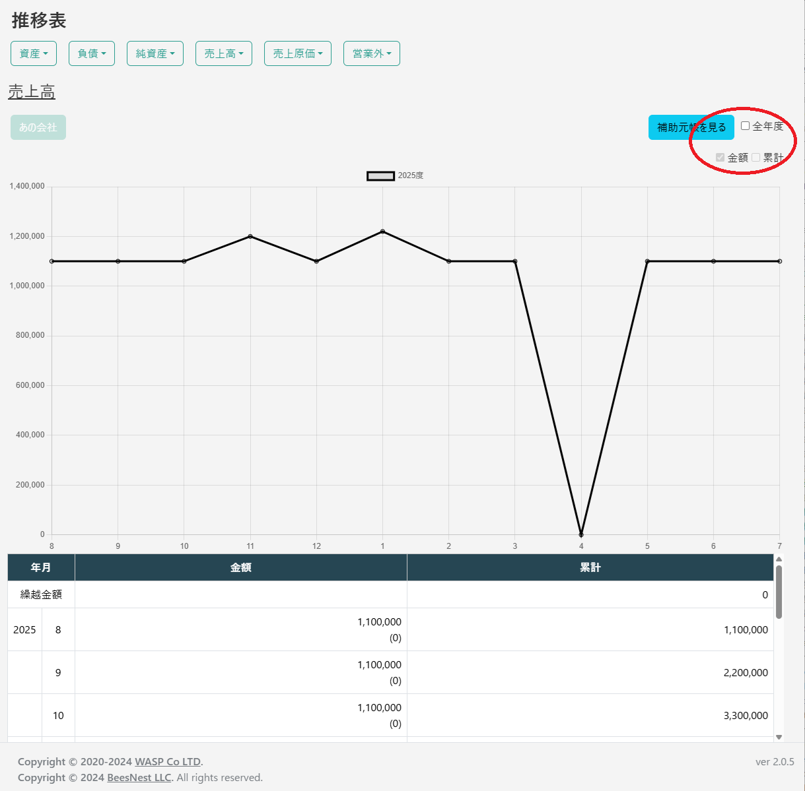
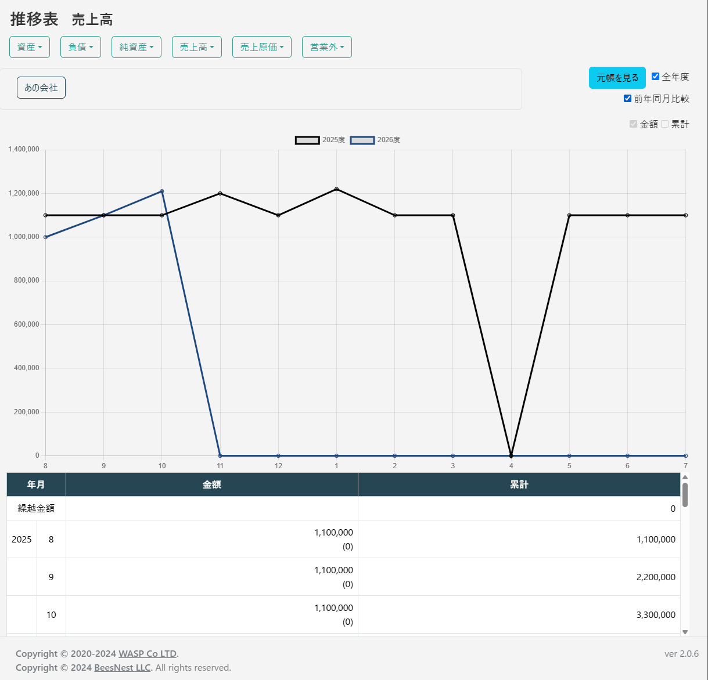

# 推移表

推移表は、特定の勘定科目の残高が、月ごとにどのように変動したかをグラフで視覚的に確認するための機能です。
季節による売上の変動や、特定の月に発生した大きな支出など、会計データの時間的な傾向を把握するのに役立ちます。

## 推移表の表示

推移表画面へのアクセス方法は2通りあります。

1.  **メニューから直接開く**
    左のメインメニューから「会計帳簿」>「推移表」を選択します。画面上部の選択欄から、表示したい勘定科目や補助科目を選択します。

2.  **元帳から開く**
    「総勘定元帳」の画面で科目を選択した状態で、「推移表を見る」ボタンをクリックすると、その科目の推移表が直接表示されます。

いずれかの方法で科目を指定すると、会計年度内の残高の推移を示す折れ線グラフが表示されます。
グラフの下には、月ごとの具体的な変動額や残高が一覧表で表示されます。

## グラフの表示オプション

画面の右上には、グラフの表示方法を切り替えるためのオプションがあります。

*   **全年度**: チェックを入れると、会計年度の区切りを越えて、システムに登録されている全期間のデータの推移を一つのグラフで確認できます。
*   **前年同月比較**: 「全年度」が有効な時に選択できます。年度ごとのデータを重ねて表示し、前年の同じ月と比較することができます。予算作成や成長率の確認に便利です。

*   **金額 / 累計**: グラフに表示する数値を切り替えます。
    *   **金額**: 各月の純粋な増減額（費用や収益の発生額）を表示します。
    *   **累計**: 期首の残高から始まり、各月の増減を反映した後の累計残高を表示します。

## 元帳への連携

グラフを確認していて、特定の月の動きが気になった場合は、「元帳を見る」または「補助元帳を見る」ボタンをクリックします。

これにより、現在表示している勘定科目の「総勘定元帳」または「補助元帳」の画面にすぐに移動でき、グラフの数値の元となった個別の取引明細をドリルダウンして確認することができます。
