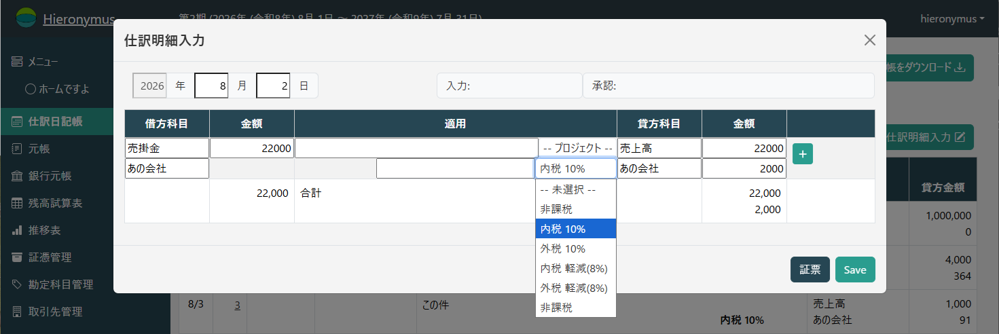

# 消費税の扱い

## 会計方式

消費税の会計処理には「税込会計方式」と「税抜会計方式」という2種類の方法があります。**消費税の申告・納付義務がある課税事業者**は、税込会計方式と税抜会計方式のいずれか任意の方式を選ぶことができます。
また、消費税の納付義務が免除されている免税事業者は、税込会計方式を行います。

いずれを選択するかはは、年度単位での設定となります。

* **税込会計方式**

    税込会計方式は、支払った代金や売上金などを、**消費税を含めて会計処理する方法**です。
    日々の記帳では、仕入にかかる消費税は仕入金額に、売上にかかる消費税は売上金額に**含めて計上**します。
    そして決算の際に、消費税を「租税公課」と「未払消費税」としてまとめて清算します。

* **税抜会計方式**

    税抜会計方式は、代金や売上金などを、消費税と本体価格に分けて会計処理する方法です。
    税抜会計方式では取引のたびに、仕入にかかる消費税を「仮払消費税」、売上にかかる消費税を「仮受消費税」として仕訳します。
    決算時には、仮払消費税と仮受消費税を相殺して、納付する消費税額を求めます。

課税事業者はいずれかが選択できますが、どちらにするかは税理士と相談の上決めてください。
非課税事業者は税込会計方式を選択します。

### メリットデメリット

実際には税理士と相談の上決めることになりますが、会計を税込でやるか税抜でやるかについては、以下の違いがあります。

* **手間**

    税込会計では、仕入や経費、売上の金額を税込価格で記録するため、帳簿づけは簡単です。
    与えられた数字をそのまま入力するだけです。
    税抜会計では、取引ごとに本体価格と消費税額を分けて記帳します。
    消費税のために1行余分に明細行が発生します。
    Hieronymusでは明細行と内容は自動的に作成されますが、少なくとも確認は必要になります。

* **損益の把握**

    税込会計では期中の損益の数字に消費税が含まれていますから、正確な把握ができません。
    税抜会計では純粋な損益の数字がわかりますし、消費税額もわかります。

* **減価償却における取得金額**

    固定資産を保有している場合、減価償却をする必要があります。
    その時に基準となるのが取得金額ですが、**税込会計をしている場合の取得金額は税込の金額**となります。
    また取得金額が10万円以下のものは固定資産になりませんし、20万円以下のものは一括償却が可能となりますが、その時の取得金額も同様の計算になります。

若干の手間は増えますが、税抜会計の方がメリットがありますし、増える手間も最小にしてありますので、Hieronymusの消費税処理は税抜会計がデフォルトとなっています。

## 仕訳明細への入力

税抜会計を選択した場合は、仕訳明細の入力の時に、課税区分の選択が表示されます。

税区分を選択すると、自動的に消費税のための行が表示されます。

.png)