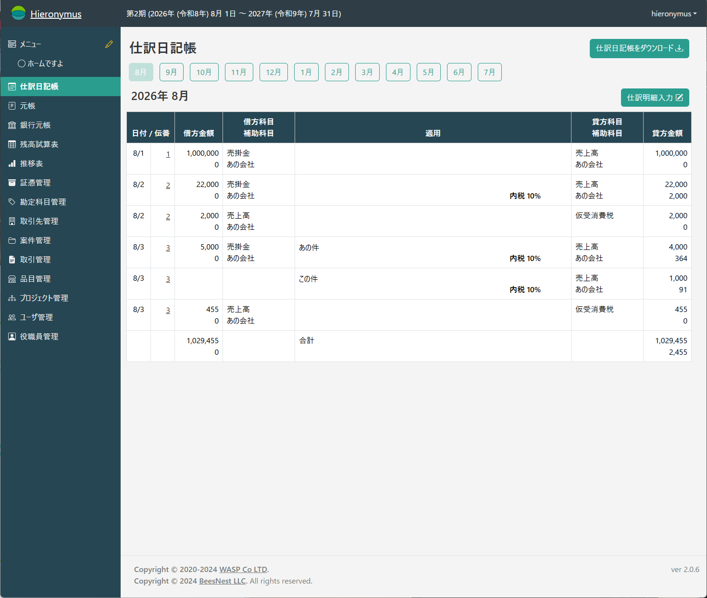
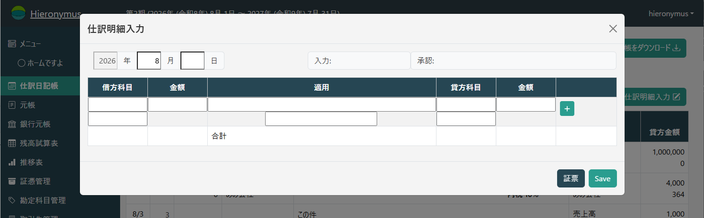
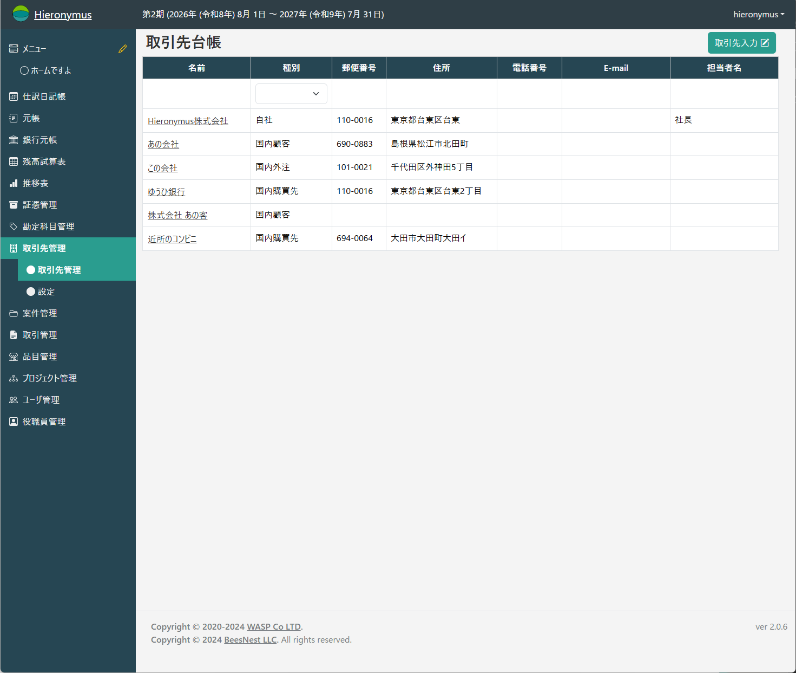
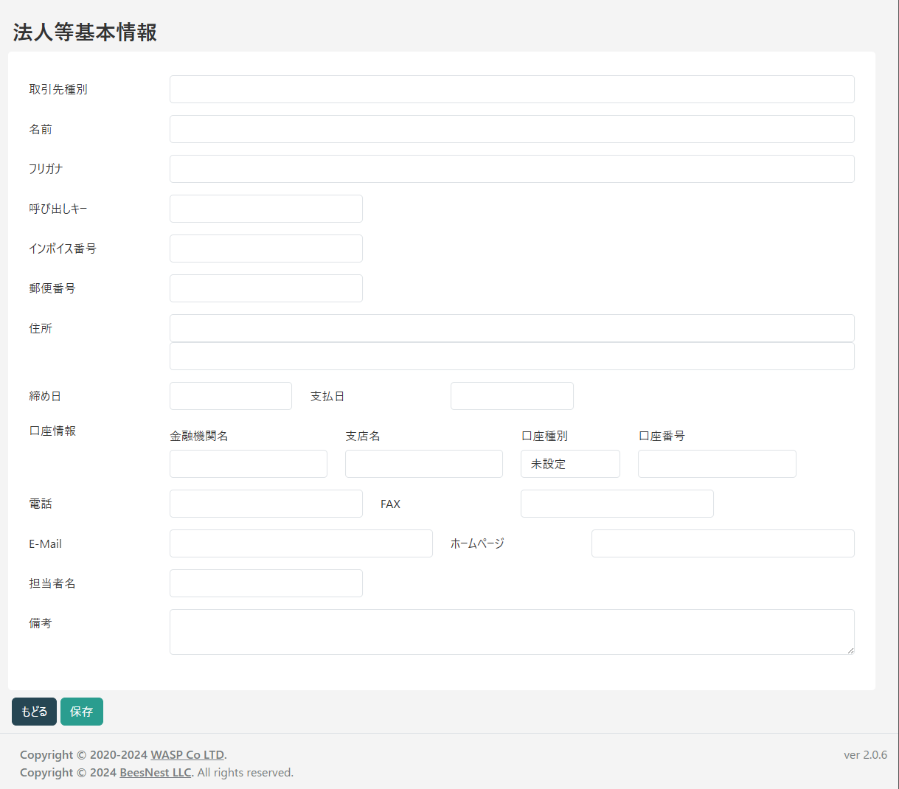

# 仕訳明細と証憑の入力

会計の主な作業は仕訳明細の入力です。
仕訳明細を正しく入力することが、日々の会計業務の中心となります。

Hieronymusは「振替伝票」をイメージした仕訳明細入力を持ったシステムです。

## 2つのワークフロー

仕訳明細を入力する流れとして、大きく2つのワークフローがあります。

*   **伝票入力から始める**: 主に経理担当者が、社内での資金移動など証憑が必ずしも必要ない取引を記録する場合に利用します。
*   **証憑入力から始める**: 主に現場の担当者が、領収書などの証憑を先に登録し、その内容をもとに後から経理担当者が伝票を作成する場合に利用します。

どちらのワークフローでも、最終的なゴールは「仕訳明細を正しく入力する」ことです。会社の運用ルールに合わせて、適切な方法を選択してください。

## 仕訳明細入力から始めるパターン

社内での資金移動（口座間の振替など）のように、特に証憑が存在しない取引を入力する場合に適した手順です。

### 仕訳明細本体の入力

1.  左のメインメニューから「仕訳日記帳」を開きます。

2.  入力したい仕訳明細の「月」を選択し、画面右上の「仕訳明細入力」ボタンをクリックします。

.png)

3.  「仕訳明細入力」のポップアップウィンドウが表示されるので、仕訳明細入力の内容を入力します。

**【注意】入力順序について**

一般的な仕訳明細とは異なり、**借方科目 → 借方金額**の順で入力する形式になっています。これは、勘定科目を先に確定させることで、消費税の自動計算などをスムーズに行うための仕様です。

4.  「科目」の入力欄に呼び出しキーを入力すると、候補となる勘定科目が表示されます。

.png)

.png)

選択して科目を確定します。

.png)

補助科目があるものは同様に補助科目の入力欄に呼び出しキーを入力すると、候補となる補助科目が表示されます。

.png)

選択して補助科目を確定します。

.png)

5.  借方金額や摘要を入力します。

.png)

.png)

6. 貸方科目を入力します。

入力の方法は借方科目と同じです。

.png)

7. 貸方金額を入力します。

.png)

貸方金額の入力欄で `=` を入力すると、借方と同じ金額が自動で入力されます。

.png)

.png)

また、複数行の伝票で貸借の差額を自動計算させたい場合は `-` を入力します。

.png)

これらは入力の手間を省くための補助機能です。
使っても使わなくても、結果は同じです。
使いやすいと思ったら使ってください。

.png)

8.  消費税課税対象の科目に金額を入力すると、消費税の選択欄が自動で表示されます。

.png)

適切な税率を選択すると、

.png)

消費税額が自動計算され、伝票に反映されます。

.png)

なお、消費税の選択肢は「システム管理画面」で追加・編集が可能です。

.png)

9. 行の追加

行を追加する場合は右端の「＋」ボタンを押します。

.png)

**次の行**が作られます。

.png)

行を削除したい場合は、削除したい行の右端の「－」ボタンを押します。

.png)

7.  入力が完了したら「保存」ボタンを押します。仕訳日記帳に内容が反映されます。

.png)

### 伝票の承認

「承認権限」を持たないユーザーが入力した伝票は、承認されるまで正式な会計データとして扱われません。未承認の伝票は伝票番号が黄色で表示されます。

.png)

承認権限を持つユーザーのホーム画面には「承認待ち」の通知が表示されます。伝票番号をクリックして内容を確認し、「承認」ボタンを押すことで伝票が確定します。

.png)

確定した伝票は変更・削除ができなくなります。

なお、未承認の伝票が存在している場合、承認権限を持っているユーザーのホーム画面には、

.png)

のように表示されます。
ここの伝票番号をクリックすると、

.png)

直接承認の必要な伝票が開きます。

.png)

ここでは修正や承認が可能です。
全て承認すると、未承認の伝票リストは消えます。

### 伝票と証憑の結合

伝票入力後に、関連する証憑を紐付けることができます。

1.  伝票の編集画面を開き、「証憑」ボタンをクリックします。

.png)

2.  伝票と同じ日付で登録されている証憑の一覧が表示されます。

.png)

3.  一覧から該当する証憑を、紐付けたい明細行へドラッグ＆ドロップします。

.png)

4.  明細行にアイコンが表示されれば、結合は完了です。この状態で保存すると、仕訳日記帳の一覧でも証憑がリンクされていることがアイコンで表示されます。

.png)

## 証憑入力から始めるパターン

現場の担当者が経費精算などで利用するケースを想定したワークフローです。担当者は受け取った領収書などの証憑をアップロードするだけで、その後の仕訳作業は経理担当者に引き継ぐことができます。

### 証憑の種類

ホーム画面下部の「証憑種別」から、登録したい証憑の種類を選択します。証憑種別は、必要に応じて追加・削除が可能です。

.png)

### 証憑の入力

#### 取引先の登録

証憑を登録する前に、その発行元である「取引先」を登録しておくことを推奨します。
インボイス制度への対応を考慮すると、一度取引があった事業者は、たとえ小額の取引であっても登録しておく方が、後々の管理が容易になります。

取引先の登録は、顧客管理機能から行います。

1. 左メニューから「取引先管理」を選択すると「取引先台帳」が表示されます。

2. 「取引先入力」をクリックします。

.png)

3. 「法人等基本情報」画面が開きます。ここから取引先の情報を入力します。

詳しい操作は、[取引先管理](./company.md)を参照してください。

#### 証憑の入力

本システムは電子化証憑の保存、検索が行えるようになっています。

証憑の登録そのものは会計の知識がなくても可能ですから、証憑をやりとりした現場の人に任せることも困難ではありませんし、そのための教育はシステムの操作だけです。
証憑の入力は、「ユーザー管理」で「会計(閲覧)」または「会計」にチェックを入れることで可能になります。

.png)

証憑入力の詳しい説明は、[証憑管理](./voucher.md)にあります。

#### 証憑からの仕訳明細作成

会計担当者は、「証憑一覧」の画面を起点として仕訳明細を入力することができます。
「証憑一覧」では、「証憑は存在しているが仕訳明細が存在していない」証憑は日付欄(発生日または支払日)が赤字で表示されています。

.png)

*   **赤色のリンク**: 
    まだ仕訳明細が作成されていない未処理の証憑です。
*   **青色のリンク**: 
    既に対応する仕訳明細が作成済みの証憑です。

青字の日付をクリックすると、その証憑の仕訳明細が表示されます。
赤字の日付をクリックすると、その証憑の仕訳明細を新規に入力するための画面が開きます。

仕訳明細の入力については、[証憑管理](./voucher.md)の「証憑からの仕訳明細作成」を参照してください。
