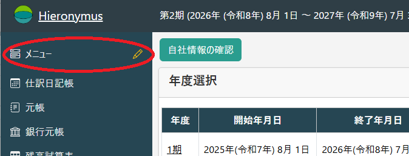

# メニュー

Hieronymusには独自のメニューを作る機能があります。

右端の鉛筆のアイコンをクリックすると、編集モードになります。

.png)

編集モード

.png)

「＋」をクリックすると、メニューの追加のドロップダウンが表示されます。

.png)

たとえば、「ホーム」を選択すると、トップメニューと似た雛形が表示されます。

.png)

「配置を保存」をクリックします。

.png)

左メニューに「ホーム」が追加されました。

.png)

メニューのタイトルを変更したい場合は、タイトルを編集します。

.png)

「配置を保存」をクリックすると、メニュー表示に反映します。

.png)

ウィジェット(表示される項目)を追加したい場合は、「ウィジェットを追加」をクリックして、

.png)

追加したいウィジェットを**ドラッグ＆ドロップ**します。

.png)

ウィジェットの位置を変更したい場合は、タイトルをドラッグします。

.png)

大きさを変更したい場合は、ウィジェット右下をドラッグします。

.png)

配置を保存して「実行モードへ」をクリックすると、実行モードとなって編集できなくなります。

.png)

この画面は左メニューをクリックするといつでも表示されます。

.png)

ウィジェットには、ホーム画面等に表示されているものの他に、「メモ」があります。

.png)

メモは、「配置を保存」することで保存されます。
通常のメモと言うよりは、どちらかと言えば静的なことを書いておくことに使うのが良いでしょう。

また、**ブラウザの任意のURLをドラッグ＆ドロップ**することで、そのURLへのリンクを追加することができます。

.png)

このようにYouTubeの**URLをドラッグ＆ドロップ**することで、サムネイルを置くことができますが、一番の目的は「Hieronymus上の任意の状態へのリンク」を張ることです。

.png)

内容を修正したい場合は「鉛筆」アイコンをクリックすれば編集できます。

.png)

URLに意味のあるページにリンクが作れますから、たとえば

* 特定の勘定科目の元帳
* 特定の売上の推移表
* 特定のプロジェクトの集計表示

といったものが直接に開くリンクが張れます。
