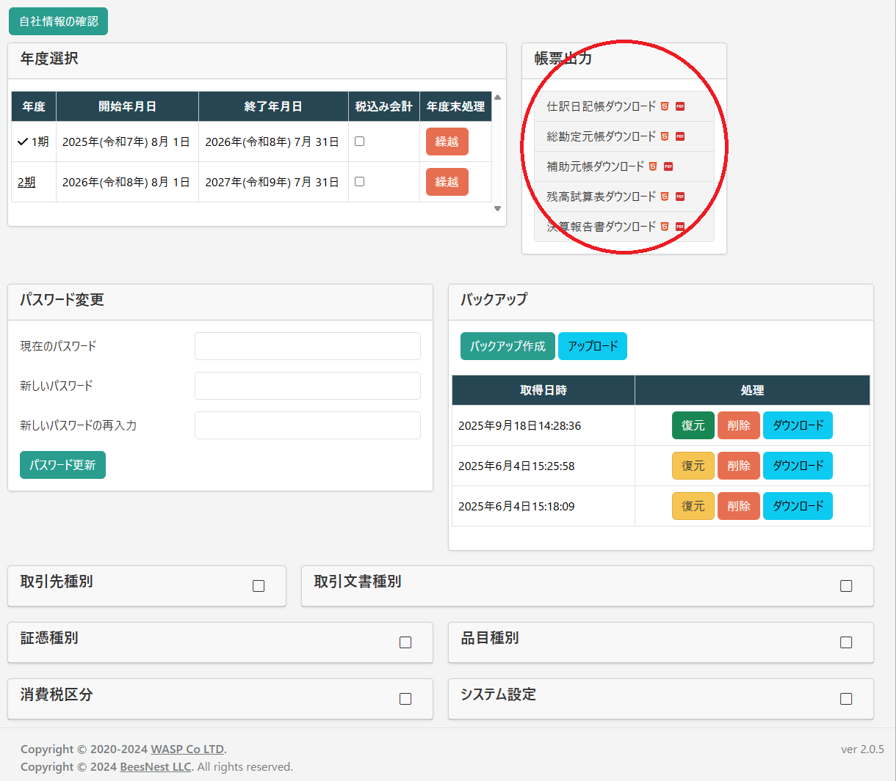
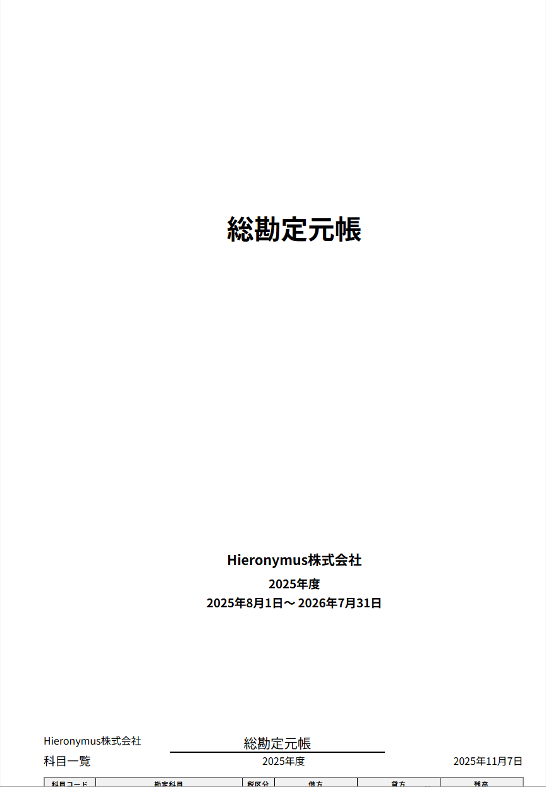
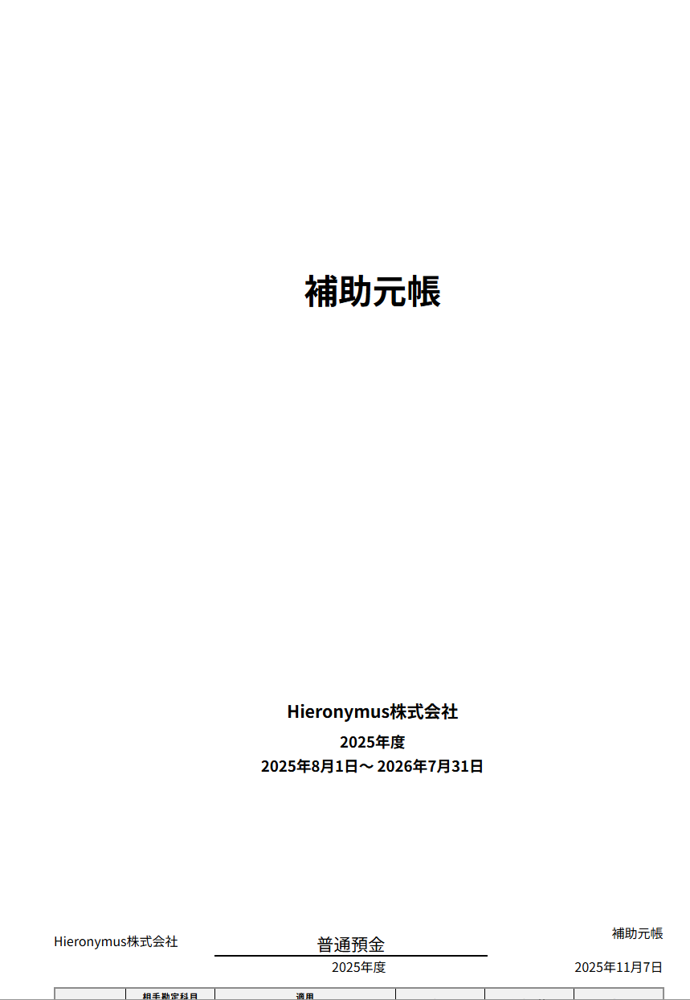
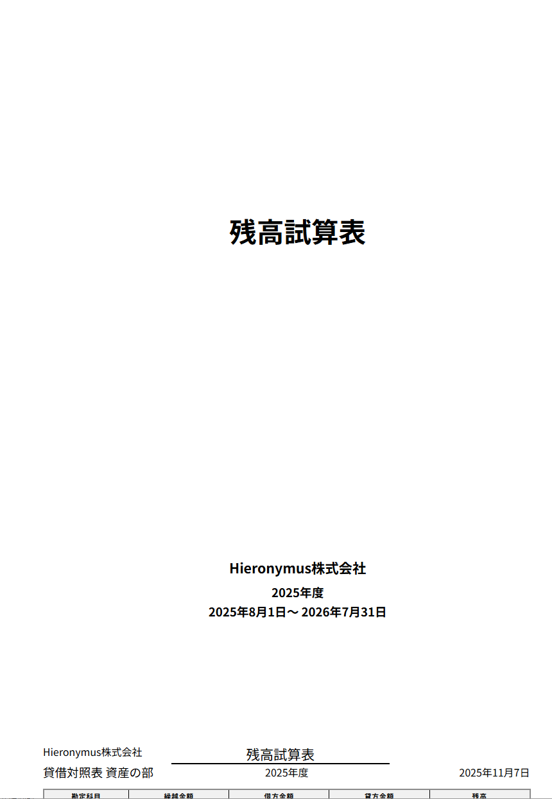
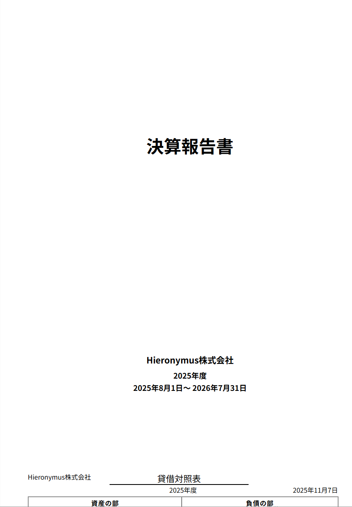

# 会計帳票の出力

日々の会計データから、経営状況の把握や決算報告に不可欠な各種会計帳票を出力します。
すべての帳票は、メインメニューの「帳票」セクションからアクセスできます。

## 出力形式と操作{#operation}

出力形式は、画面での確認のほか、PDFファイルとしてダウンロードすることも可能です。
いずれもA4サイズで出力することが想定されています。

*   **画面表示 (HTML5)**: Webブラウザで直接内容を確認できます。ブラウザで印刷指示すれば帳票として印刷可能です
*   **PDF**: 印刷やファイルでの保存に適したPDF形式でダウンロードします。このままファイルとしても扱えますし、印刷することも可能です

左側のアイコンをクリックするとHTML5形式、右側のアイコンをクリックするとPDF形式です。

## 主要な会計帳票{#reports}
以下は、会計帳簿・報告書の体系的な整理です。
それぞれ「**目的**」と「**わかること**」を対比してまとめました。

### 1. 仕訳日記帳 (Journal){#journal}

**目的：**
日々の取引を、発生順（時系列）に記録するための帳簿。
すべての取引を「借方・貸方」で仕訳して記録し、後の集計の基礎となる。

**わかること：**

* いつ、どんな取引があったか（発生日と内容）
* どの勘定科目が、いくら増減したか
* 取引の流れや発生順序
  →「会社の日記」のような役割。

この帳票はどこかに提出するという種類のものではありませんが、取引の記録が全て出ている帳票ですから、取引記録の保存や検算に使うことができます。

.png)

### 2. 総勘定元帳 (General Ledger){#general_ledger}

**目的：**
仕訳日記帳の取引を勘定科目ごとにまとめ、各科目の増減と残高を明らかにする。

**わかること：**

* 各勘定科目（現金・売上・仕入など）の増減状況
* 各科目の期末残高（現金残高、売掛金残高など）
  →決算書を作るための「科目別台帳」。

総勘定元帳は、その年度に繰越、残高、取引のあった勘定科目のみが出力されます。
使われていない勘定科目については出力されません。

### 3. 補助元帳 (Subsidiary Ledger){#subsidiary_ledger}

**目的：**
総勘定元帳の中でも特定の科目（例：売掛金、買掛金など）を、相手先や品目別などにさらに詳細化して管理する。

**わかること：**

* 取引先別の売掛金・買掛金残高
* 社員別の立替金や貸付金残高
* 物品ごとの在庫や仕入れ状況
  →「総勘定元帳を細かく見た内訳」。

補助元帳には補助科目のみが出力されます。
補助科目のない勘定科目については出力されません。

### 4. 試算表 (Trial Balance){#trial_balance}

**目的：**
総勘定元帳の各科目残高をまとめ、借方・貸方の合計が一致しているかを確認する。
また、経営状況を把握する中間資料として使われる。

**わかること：**

* 帳簿の整合性（借方・貸方の合計が一致）
* 現時点での資産・負債・収益・費用のバランス
* 損益の概算や経営の健全性
  →決算前の「成績表（下書き）」。

### 5. 決算報告書（Financial Statements）{#financial_statements}

貸借対照表・損益計算書・製造原価報告書など

**目的：**
1年間の経営成績と財政状態を明らかにし、社内外（株主・金融機関・税務署など）へ報告する。

**わかること：**

* **貸借対照表（B/S）**：資産・負債・純資産の状況 →「会社の体力」
* **損益計算書（P/L）**：売上・費用・利益 →「会社の成績」
* **製造原価報告書**：製品を作るのにかかった原価 →「コスト構造」
* **販売費及び一般管理費明細書**：経費の内訳（給与・家賃・通信費など）

→1年間の総まとめ。「会社の健康診断書」。

### 流れまとめ（全体像）

| 帳簿    | 内容・目的         | 主な確認点        |
| ----- | ------------- | ------------ |
| 仕訳日記帳 | 日々の取引を時系列で記録  | 取引内容の正確さ     |
| 総勘定元帳 | 科目ごとに集計       | 各科目の残高       |
| 補助元帳  | 相手先などの詳細内訳    | 取引先別・品目別残高   |
| 試算表   | 集計の整合性を確認     | 借貸一致・中間損益    |
| 決算報告書 | 年間の成績・財務状況を報告 | 経営状況の把握・外部報告 |

