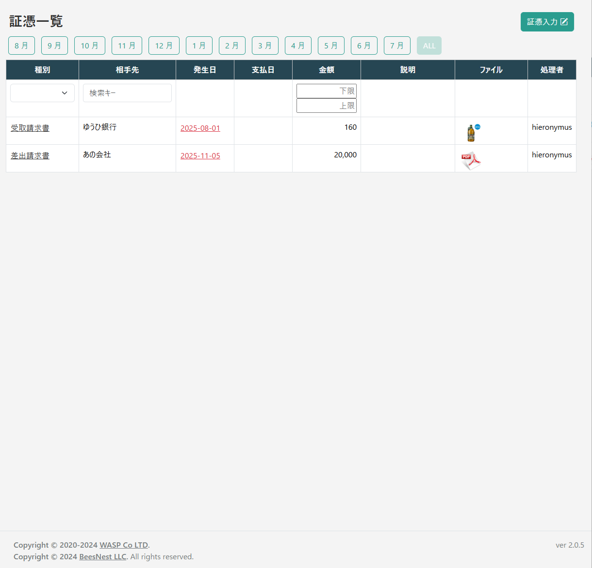
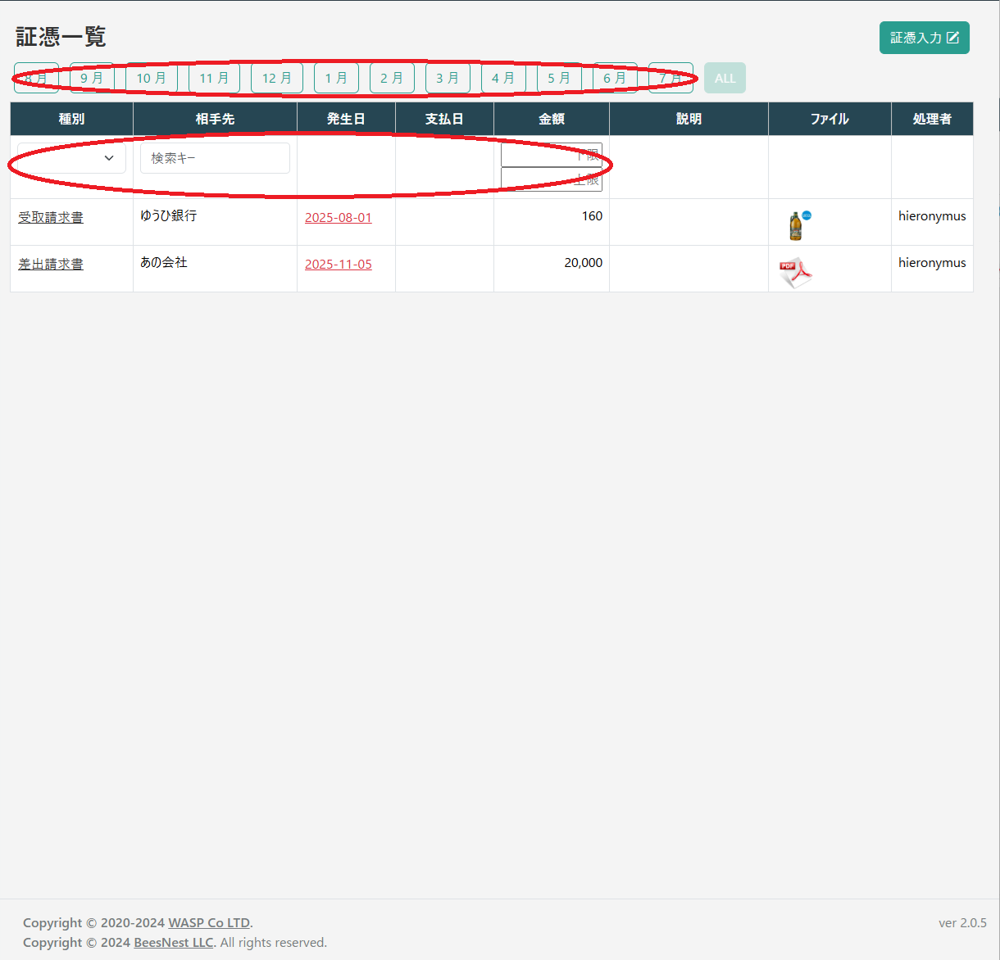
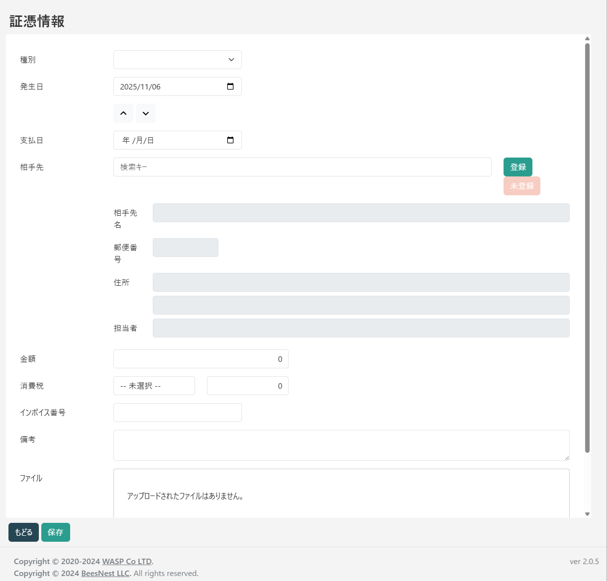
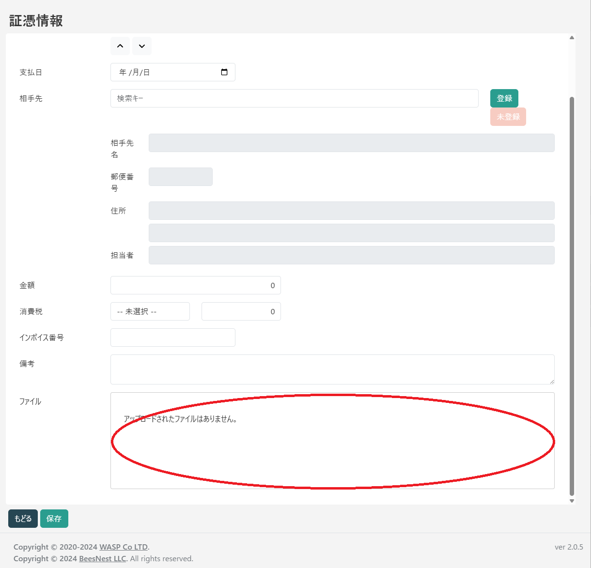
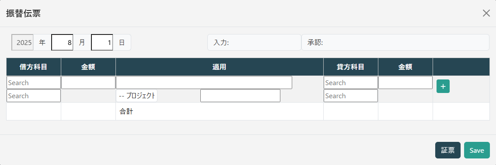

# 証憑管理

証憑管理は、領収書や請求書といった取引の証拠となる書類（証憑）を電子データとして保存し、会計データと紐付けて一元管理するための機能です。ペーパーレス化を推進するとともに、電子帳簿保存法の要件に対応した証憑の管理を支援します。

登録した証憑から直接、振替伝票を作成することができるため、入力の手間を削減し、ミスを防ぎます。

## 証憑一覧の確認と絞り込み

左のメインメニューから「証憑管理」を選択すると、登録されている証憑が一覧で表示されます。

一覧には、証憑のサムネイル、種別、取引相手、日付、金額などが表示されます。
画面上部には、表示する証憑を絞り込むための強力なフィルタ機能が備わっています。

*   **月フィルタ**: 特定の月に登録された証憑、または全期間（ALL）の証憑を表示します。
*   **内容フィルタ**: 一覧のヘッダー直下の行で、さらに詳細な条件で絞り込むことができます。
    *   **種別**: 「領収書」「請求書」など、証憑の種類で絞り込みます。
    *   **相手先**: 取引先の名前で絞り込みます。
    *   **金額**: 金額の下限・上限を指定して、範囲で絞り込みます。

## 証憑の登録と編集

### 新規登録

一覧画面の右上にある「証票入力」ボタンをクリックすると、新規登録画面に移動します。

.png)

### 編集

一覧画面で、編集したい証憑の行にある「種別」のリンク（例: `領収書`）をクリックすると、その証憑の編集画面に移動します。

.png)

### 入力項目とファイルアップロード

証憑の登録・編集画面では、以下の情報を入力します。

*   **種別**: 領収書、請求書などの種類を選択します。
*   **発生日**: 取引が発生した日付です。
*   **支払日**: 実際に支払いを行った、または行う予定の日付です。
*   **相手先**: 取引先の名称です。あらかじめ顧客管理機能で登録しておく必要があります。
*   **金額・消費税**: 取引の金額と、適用される消費税のルールを選択します。税額は自動で計算されます。
*   **インボイス番号**: 適格請求書発行事業者の登録番号を入力します。
*   **備考**: 取引に関するメモなどを自由に残せます。

**ファイルのアップロード**

証憑のPDFファイルや、スキャンした画像ファイルは、画面のどこにでもドラッグ＆ドロップするだけでアップロードできます。複数のファイルを一度にアップロードすることも可能です。

アップロードされたファイルはサムネイルで表示され、不要なものはゴミ箱アイコンで削除できます。

！[証憑ファイルのアップロードエリア(ファイル)](./images/証憑ファイルのアップロードエリア(ファイル).png)

すべての情報を入力したら、「保存」ボタンで登録を完了します。

.png)

## 証憑からの仕訳明細作成

登録した証憑は、振替伝票と紐付けることができます。一覧画面の「発生日」列のリンクの色によって、伝票の処理状況がわかります。

.png)

*   **赤色のリンク**: まだ仕訳明細が作成されていない未処理の証憑です。
*   **青色のリンク**: 既に対応する仕訳明細が作成済みの証憑です。

### 未処理の証憑から伝票を作成する

赤色の発生日リンクをクリックすると、その証憑の情報（日付、金額、相手先、備考など）が引き継がれた状態で、伝票作成のポップアップウィンドウが開きます。

これにより、ユーザーは勘定科目を指定するだけで、簡単かつ正確に振替伝票を作成することができます。

### 処理済みの伝票を確認する

青色の発生日リンクをクリックすると、

.png)

この証憑に紐付いて作成された振替伝票がポップアップで表示されます。取引の詳細をすぐに確認したい場合に便利です。

.png)
